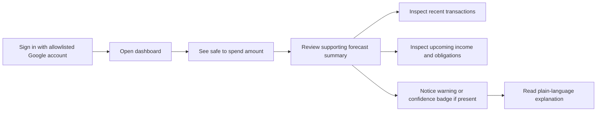
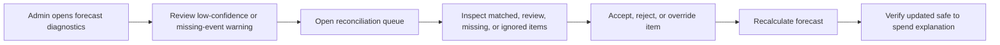
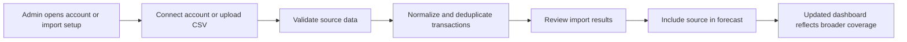
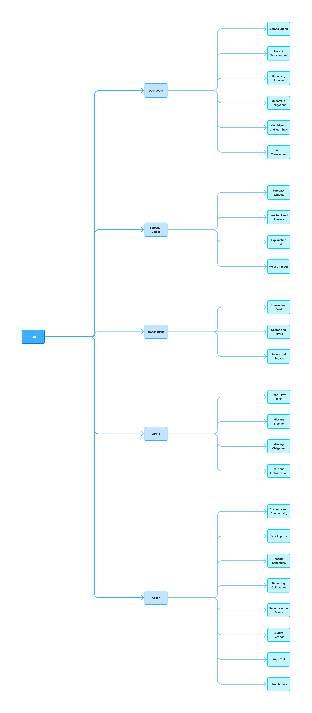

# UX Flows

## Design Principle

The UX should put the answer first. The non-technical user should see `safe to spend` immediately, while the admin user can drill into forecast logic, reconciliation state, and system health.

## Primary Household Journey

## Admin Reconciliation Journey

## New Data Source Journey

## Site Map

## UX Notes

- `Dashboard` is the default landing page for both users.
- `Admin` sections should be hidden from the non-technical household user by default.
- Warning copy should favor plain language first and technical detail second.
- Confidence indicators should explain why the number is trustworthy or conservative.
